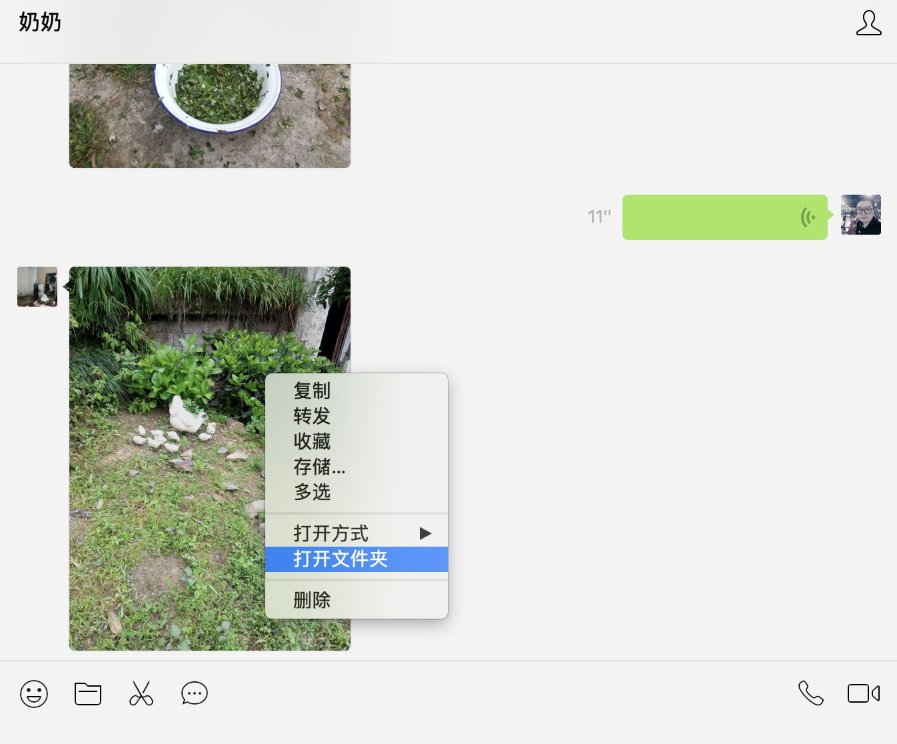
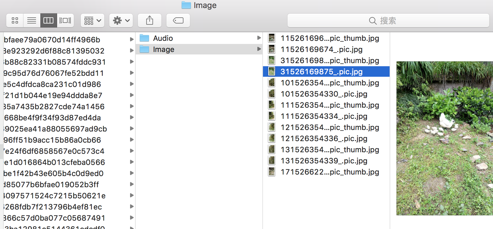
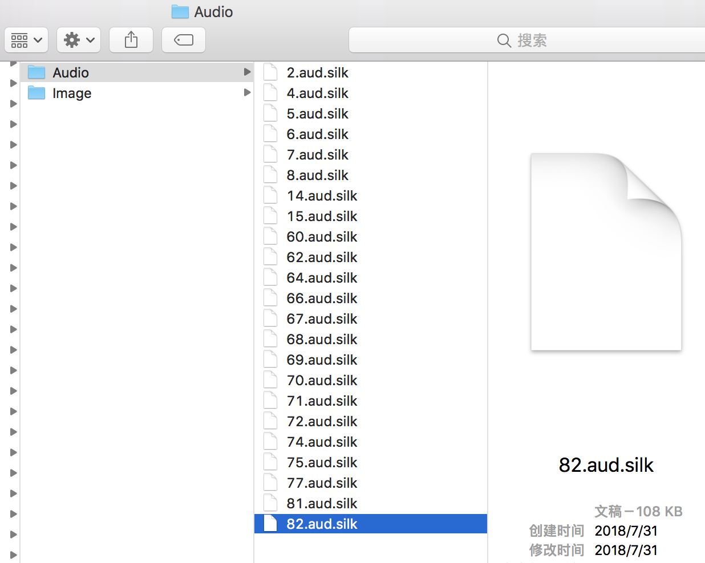
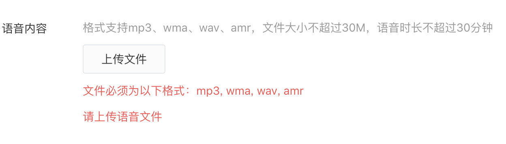
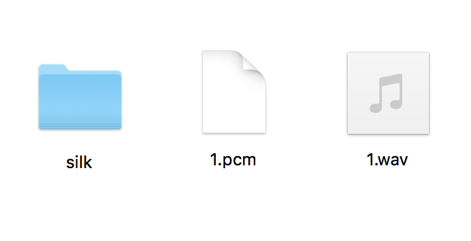

奶奶八十多了，经常与远隔千里之外的我微信互动交流。

我想可以抽空记录下奶奶的话，也算是口述历史，可以供儿孙辈翻阅看下，从历史的视角来了解先辈他们对世界，对社会，对自己的看法。

一定程度上也能反思下自己，自己的角色，自己的人生观，自己的价值观，乃至历史观。

奶奶上过几年学，认字对于日常的文字交流基本无障碍，但怕奶奶累着，我建议奶奶还是用语音来交流。

她给我发的语音，如何提取出来编辑处理，处理微信语音的存储格式转换。

特撰写记录下，如何将微信silk格式语音文件转换为wav格式。


>日期：2018年08月01日
>环境：MacBook Pro，macOS High Sierra 10.13.5(17F77)

###第一步：找到语音文件将其导出
1、找到MAC微信语音、小视频和图片等在本地保存位置地址
2、在对话界面右键图片有打开文件夹  

3、Image之上的Audio目录就是存储的会话语音  


可以看到其后缀是.silk  

然后就可以拷贝导出了.

###第二步：处理文件转换为公众号文章可以支持发布的格式


微信公众号支持格式为mp3、wma、wav、amr  


如果环境没有安装过homebrew
```
/usr/bin/ruby -e "$(curl -fsSL https://raw.githubusercontent.com/Homebrew/install/master/install)"
```

>依赖
>gcc
>ffmpeg

看下环境有没有gcc，如下则有
```
ZBMAC-C02VQ200H:Desktop dubiaoqi$ gcc --version
Configured with: --prefix=/Library/Developer/CommandLineTools/usr --with-gxx-include-dir=/usr/include/c++/4.2.1
Apple LLVM version 9.1.0 (clang-902.0.39.2)
Target: x86_64-apple-darwin17.6.0
Thread model: posix
InstalledDir: /Library/Developer/CommandLineTools/usr/bin
```
若无：
```
brew install gcc
```
安装ffmpeg
```
brew install ffmpeg
```
git克隆silk-v3-decoder
```
git clone https://github.com/kn007/silk-v3-decoder.git silk-v3-decoder 
```

```
ZBMAC-C02VQ200H:Desktop dubiaoqi$ /data/app/silk-v3-decoder/converter.sh 82.aud.silk mp3
[Warning] Convert 82.aud.silk false, maybe not a silk v3 encoded file.
```
尝试转换，失败了 :（   
https://kn007.net/topics/update-silk2mp3-to-official-version/

查文档，尝试其它格式转换
```
ZBMAC-C02VQ200H:silk-v3-decoder dubiaoqi$ cd silk/
ZBMAC-C02VQ200H:silk dubiaoqi$ ll
total 856
-rw-r--r--    1 dubiaoqi  wheel    3278  8  1 11:28 Makefile
-rwxr-xr-x    1 dubiaoqi  wheel   97832  8  1 11:30 decoder
drwxr-xr-x    6 dubiaoqi  wheel     192  8  1 11:28 interface
-rw-r--r--    1 dubiaoqi  wheel  335088  8  1 11:30 libSKP_SILK_SDK.a
drwxr-xr-x  269 dubiaoqi  wheel    8608  8  1 11:30 src
drwxr-xr-x    6 dubiaoqi  wheel     192  8  1 11:30 test
ZBMAC-C02VQ200H:silk dubiaoqi$ ./decoder /data/silk/82.aud.silk /data/1.pcm
********** Silk Decoder (Fixed Point) v 1.0.9.6 ********************
********** Compiled for 64 bit cpu *******************************
Input:                       /data/silk/82.aud.silk
Output:                      /data/1.pcm
Packets decoded:              3002
Decoding Finished 

File length:                 60.040 s
Time for decoding:           0.072 s (0.121% of realtime)

ZBMAC-C02VQ200H:silk dubiaoqi$ ffmpeg -y -f s16le -ar 24000 -ac 1 -i  /data/1.pcm  -f wav -ar 16000 -b:a 16 -ac 1  /data/1.wav
ffmpeg version 4.0.2 Copyright (c) 2000-2018 the FFmpeg developers
  built with Apple LLVM version 9.1.0 (clang-902.0.39.2)
  configuration: --prefix=/usr/local/Cellar/ffmpeg/4.0.2 --enable-shared --enable-pthreads --enable-version3 --enable-hardcoded-tables 
  --enable-avresample --cc=clang --host-cflags= --host-ldflags= --enable-gpl --enable-libmp3lame --enable-libx264 --enable-libxvid --enable-opencl 
  --enable-videotoolbox --disable-lzma
  libavutil      56. 14.100 / 56. 14.100
  libavcodec     58. 18.100 / 58. 18.100
  libavformat    58. 12.100 / 58. 12.100
  libavdevice    58.  3.100 / 58.  3.100
  libavfilter     7. 16.100 /  7. 16.100
  libavresample   4.  0.  0 /  4.  0.  0
  libswscale      5.  1.100 /  5.  1.100
  libswresample   3.  1.100 /  3.  1.100
  libpostproc    55.  1.100 / 55.  1.100
[s16le @ 0x7faaef800000] Estimating duration from bitrate, this may be inaccurate
Guessed Channel Layout for Input Stream #0.0 : mono
Input #0, s16le, from '/data/1.pcm':
  Duration: 00:01:00.00, bitrate: 384 kb/s
    Stream #0:0: Audio: pcm_s16le, 24000 Hz, mono, s16, 384 kb/s
Stream mapping:
  Stream #0:0 -> #0:0 (pcm_s16le (native) -> pcm_s16le (native))
Press [q] to stop, [?] for help
[pcm_s16le @ 0x7faaee02b400] Bitrate 16 is extremely low, maybe you mean 16k
Output #0, wav, to '/data/1.wav':
  Metadata:
    ISFT            : Lavf58.12.100
    Stream #0:0: Audio: pcm_s16le ([1][0][0][0] / 0x0001), 16000 Hz, mono, s16, 256 kb/s
    Metadata:
      encoder         : Lavc58.18.100 pcm_s16le
size=    1875kB time=00:01:00.00 bitrate= 256.0kbits/s speed=2.05e+03x    
video:0kB audio:1875kB subtitle:0kB other streams:0kB global headers:0kB muxing overhead: 0.004062%
ZBMAC-C02VQ200H:silk dubiaoqi$ 
```
成功！！！转换完成  



相关链接  
Homebrew:  https://brew.sh/  
FFmpeg官网：http://ffmpeg.org/  
Git:  https://git-scm.com/  
致谢kn007开源：  
silk-v3-decoder：https://github.com/kn007/silk-v3-decoder  
kn007的回答：https://www.v2ex.com/t/171735  

